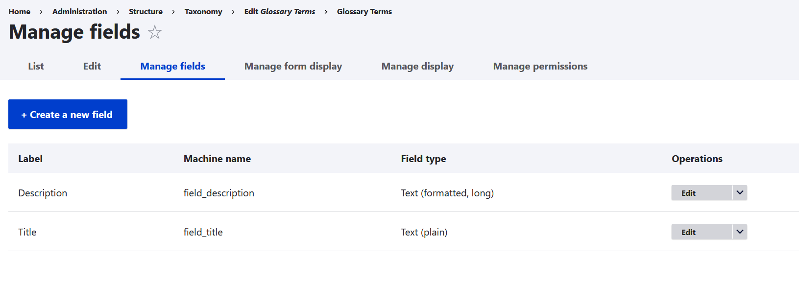
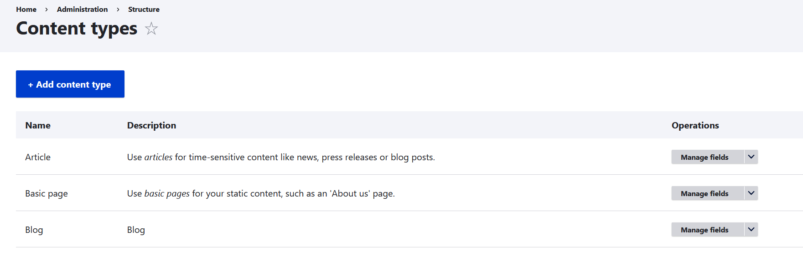

Backend Engineer

1. I created a vocabulary called "Glossary Terms"

2. I created a content type called "Blog"

3. I created a custom module called "scan_module" with the coded in scan_module.module

I used the hook "hook_ENTITY_TYPE_view()" for scanning the body of the blog whenever is going to
be rendered on screen.
